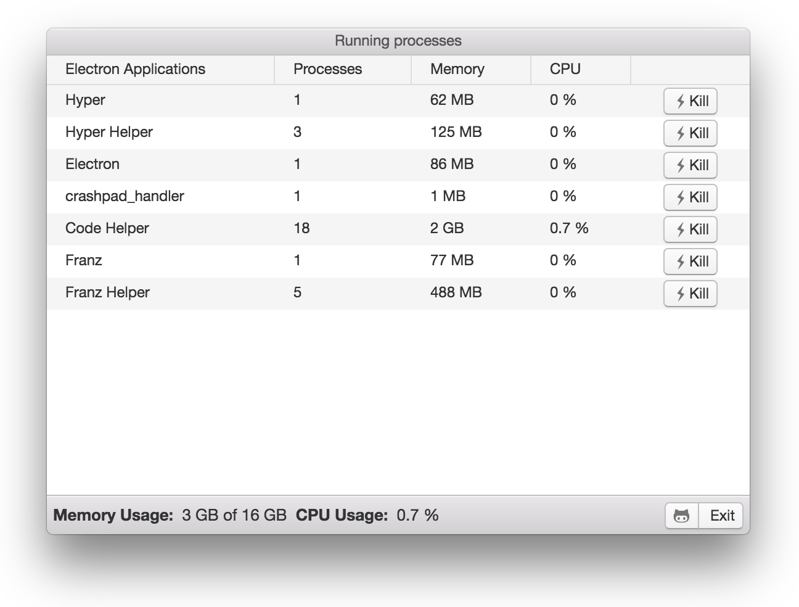

# Electrocute

Simple app that shows you how many resources your electron apps are costing you (Running apps).




## Developing

````bash
# install dependencies
yarn install
````

```bash
# Run the server and app in development mode
yarn  dev
```

### Building a binary
``` bash
# Build the app and create a release in the /releases folder
yarn build
